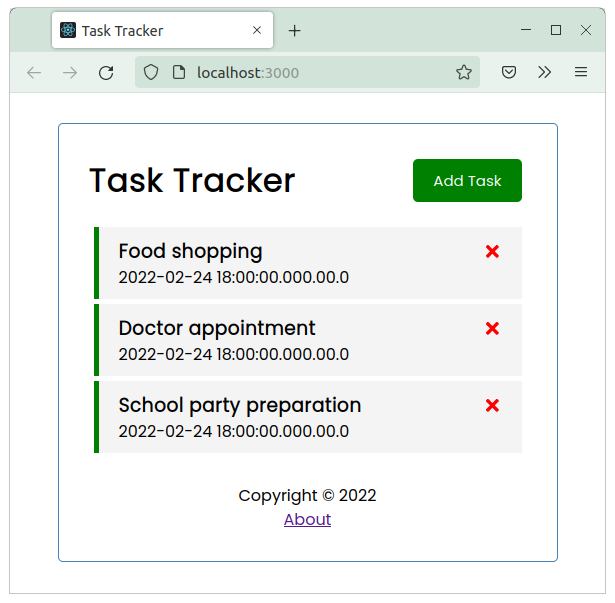
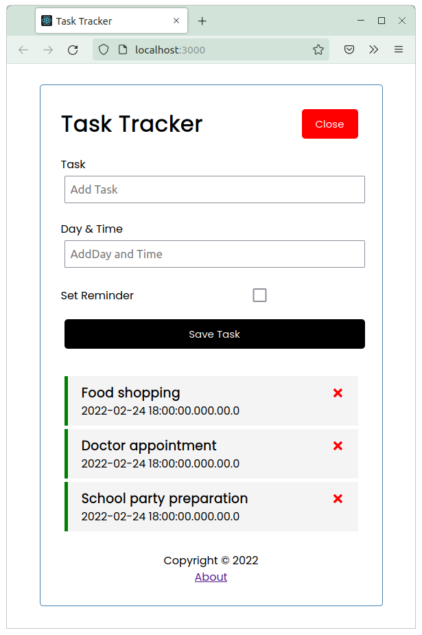
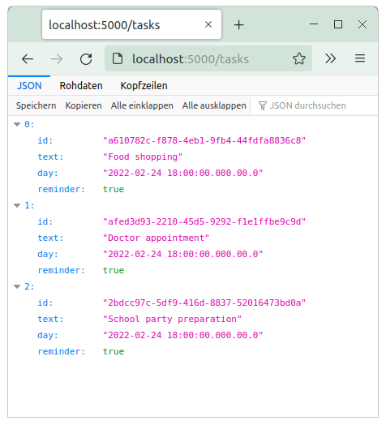

# Task Tracker
This is my result of Brad Traversy's "React JS Crash Course" Video on YouTube. This is a very good course to learn the React JS basics.

## Usage
Run the task tracker app locally: 
<code>
npm start
</code>  

The app shows the task list:

You can delete tasks by clicking the red x. You can add a new task by clicking the button "Add Task".

## Database
### Loading data from JSON Server
see: https://github.com/typicode/json-server

install the json-server, locally: 
<code>
npm i json-server
</code>

in package.json add the following script: 
<code>
"server": "json-server --watch db.json --port 5000"
</code>

and run the server: 
<code>
npm run Server
</code>

### Loading data from the backend server (spring-task-tracker-rest)
Run the spring boot application of the project "spring-task-tracker-rest". The server uses a H2 in-memory database and provides the data via a REST interface.

Usage: 
<code>
GET http://localhost:5000/tasks
</code>

